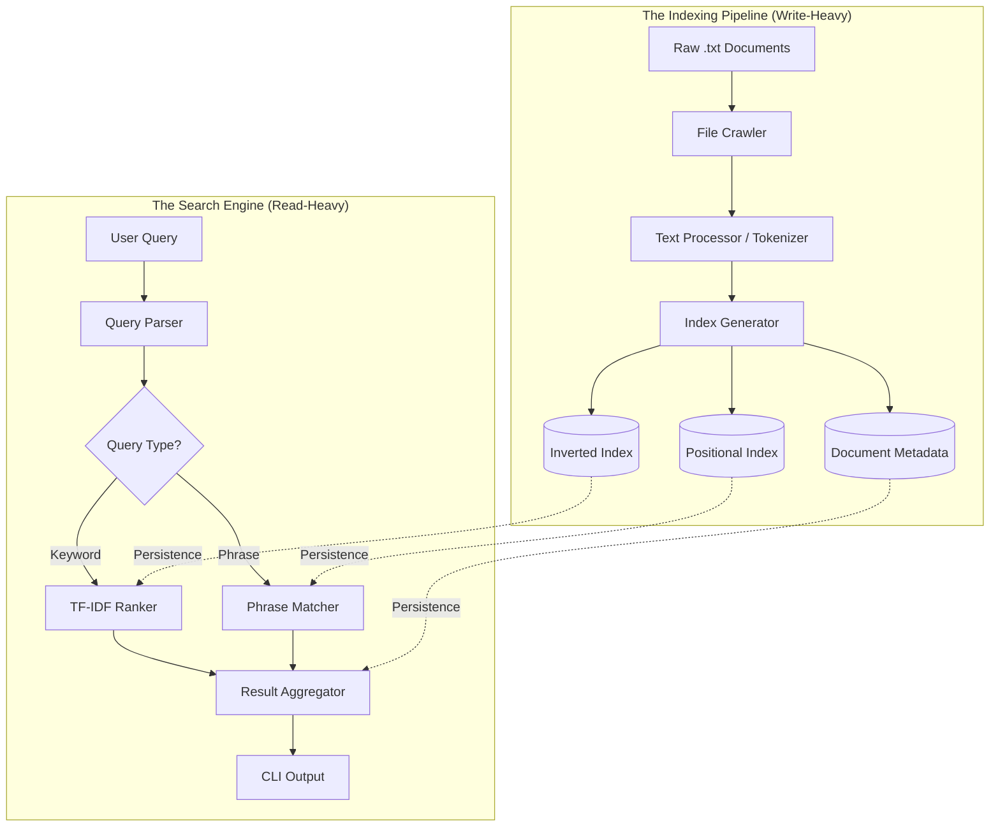

# 🔍 LocalSearch++ — A High-Performance C++ Search Engine

LocalSearch++ is a robust, local-first document search engine engineered in C++17. It implements the core architectural principles of modern search engines like Google or Elasticsearch, scaled down for lightning-fast indexing and retrieval of local text corpora.

This project goes beyond simple string matching by utilizing **Inverted Indexing**, **TF-IDF Ranking**, and **Positional Adjacency Algorithms** to deliver precise and relevance-ordered results.

---

## 🏗️ System Architecture

LocalSearch++ follows a decoupled architecture, separating the heavy computational task of **Indexing** from the latency-sensitive task of **Querying**.



---

## 🧠 Core Engineering Concepts

### 1️⃣ The Inverted Index (The Backbone)
In a traditional search, one might scan $N$ documents for a word $W$, taking $O(N)$ time. LocalSearch++ uses an **Inverted Index**, a mapping from terms to their locations.
- **Data Structure:** `std::unordered_map<std::string, PostingList>`
- **Posting List:** A vector of `std::pair<int, int>` mapping `DocID` to `Frequency`.
- **Performance:** This reduces keyword lookup to **average $O(1)$** per term, regardless of the number of documents.

### 2️⃣ Positional Indexing (Context-Awareness)
Standard inverted indices can only tell if a word exists. Our **Positional Inverted Index** stores the exact integer offset (token position) of every occurrence.
- **Purpose:** Essential for **Exact Phrase Searching**.
- **Adjacency Logic:** To match "machine learning", the engine verifies that `learning` appears at `index + 1` of `machine` within the same document.

### 3️⃣ TF-IDF (The Relevance Formula)
Not all matches are equally relevant. We rank results using the **TF-IDF (Term Frequency-Inverse Document Frequency)** algorithm:

$$Score(q, d) = \sum_{t \in q} \left( \frac{count(t, d)}{length(d)} \times \log\left(\frac{N}{df(t)}\right) \right)$$

| Component | Logic | Impact |
| :--- | :--- | :--- |
| **Term Frequency (TF)** | $\frac{count(t, d)}{len(d)}$ | Rewards documents that discuss a topic frequently. Length normalization ensures short docs aren't ignored. |
| **Inverse Doc Freq (IDF)** | $\log\left(\frac{N}{df(t)}\right)$ | Penalizes words like "the" (if not in stopwords) and rewards rare technical terms. |

---

## 📂 Internal Data Formats
The system persists data in optimized, pipe-delimited flat files (`data/index/`). This format is chosen over JSON/XML for **extreme parsing speed** and **human readability**.

| File | Structure | Purpose |
| :--- | :--- | :--- |
| `docs.meta` | `docId\|filePath\|tokenCount` | Essential for TF calculation (document length normalization). |
| `inverted.idx` | `term\|docId:freq,docId:freq` | Pre-calculated frequencies for keyword retrieval. |
| `positional.idx` | `term\|docId:p1,p2;docId:p3` | Raw offsets used for phrase verification logic. |

---

## 🚀 Getting Started

### 🛠️ Compilation
Ensure you have a C++17 compatible compiler (GCC 9+, Clang 10+).

```bash
# Standard Build
g++ -std=c++17 src/main.cpp src/utils/TextUtils.cpp src/crawler/FileCrawler.cpp src/indexer/DocumentStore.cpp src/indexer/InvertedIndex.cpp src/indexer/PositionalInvertedIndex.cpp src/search/TFIDFSearch.cpp src/search/PhraseSearch.cpp -o localsearch

# Optimized Build (High Performance)
g++ -std=c++17 -O3 -march=native -ffast-math src/main.cpp src/utils/TextUtils.cpp src/crawler/FileCrawler.cpp src/indexer/DocumentStore.cpp src/indexer/InvertedIndex.cpp src/indexer/PositionalInvertedIndex.cpp src/search/TFIDFSearch.cpp src/search/PhraseSearch.cpp -o localsearch
```

### 🏃 Running the Engine

#### Phase 1: Indexing
```bash
./localsearch index data/docs
```

#### Phase 2: Searching
**Ranked Keyword Search:**
```bash
./localsearch search "high performance c++ search"
```

**Exact Phrase Search:**
```bash
./localsearch phrase "inverted index"
```

---

## 🧪 Detailed Technical FAQ (Probing the Internals)

### Q: Why C++ for a search engine?
**A:** C++ offers zero-cost abstractions and direct control over memory layout. Search involves processing massive vectors of integers (posting lists); C++'s memory management allows us to minimize cache misses and utilize SIMD instructions (if optimized further) which interpreted languages like Python cannot match.

### Q: How does the engine handle memory during indexing?
**A:** It uses **In-Memory Buffer Steaming**. As the crawler finds files, tokens are accumulated in hash-maps. Because indices grow linearly with the corpus size, we use `std::unordered_map` for $O(1)$ insertions. Once crawling is complete, the entire structure is serialized to flat files.

### Q: How does Phrase Search handle huge doc-sets?
**A:** It uses **Linear Scaling Adjacency Check**. Instead of a naive nested loop, we iterate through the posting list of the first word and only check the presence of subsequent words if the document IDs match. This significantly prunes the search space.

### Q: What is the benefit of Stopword removal?
**A:** It reduces the index size by roughly **30-40%** in English corpora. This decreases disk I/O during lookup and avoids "noise" in TF-IDF calculations, as common words have near-zero IDF value anyway.

### Q: Why pipe-delimited files instead of a Database?
**A:** For a local search engine, a DB adds overhead (TCP connections, locking, SQL parsing). Simple flat files allow for **Sequential I/O (faster on HDD/SSD)** and zero-dependency portability. It also makes the index **Git-friendly**.

### Q: Is the engine Thread-Safe?
**A:** Currently, the indexing is single-threaded for simplicity. However, the architecture is designed such that the `Search` module can be run in parallel (Read-Only access to index) across multiple user queries without locks.

---

## 📊 Performance Benchmarks (Theoretical)

| Operation | Complexity | Technical Justification |
| :--- | :--- | :--- |
| **Crawling** | $O(N)$ | Standard directory traversal. |
| **Tokenization** | $O(M)$ | Single pass over all $M$ characters in the corpus. |
| **Search (Keyword)**| $O(K \times \text{avg\_postings})$ | Constant time lookup for $K$ words, then iterating hits. |
| **Search (Phrase)** | $O(D \times L \times W)$| $D$ docs, $L$ avg positions, $W$ words in phrase. |

---

## 🔮 Possible Technical Extensions
- **Multi-threaded Indexing**: Using `std::async` or a thread pool to tokenize multiple files in parallel.
- **Top-K Retrieval**: Implementing a **Min-Heap** to store only the top 100 results instead of sorting a vector of 100,000 matches.
- **Wildcard Search**: Using a **Trie** data structure to support queries like `search*`.
- **Incremental Indexing**: Checking file checksums (MD5) to only re-index files that have changed.

---

## 👨‍💻 Project Impact
This project demonstrates advanced systems architecture concepts:
- **Persistence:** Efficiently serializing complex heap-allocated maps to disk.
- **Normalization:** Implementing mathematical models to solve real-world ranking problems.
- **Efficiency:** Writing memory-conscious code that prioritizes execution speed.

---

## 👨‍💻 Author
**Aman Kumar**  
*B.Tech CSE | IIIT Manipur*  
Extensive experience in C++, Backend Systems, and Data Engineering.

---

## 📜 License
MIT © Aman Kumar 2024. See `LICENSE` for details.